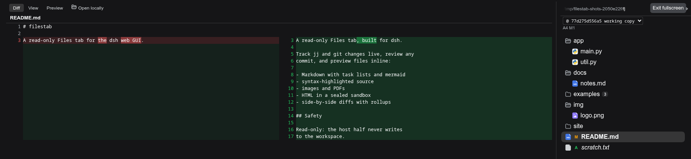
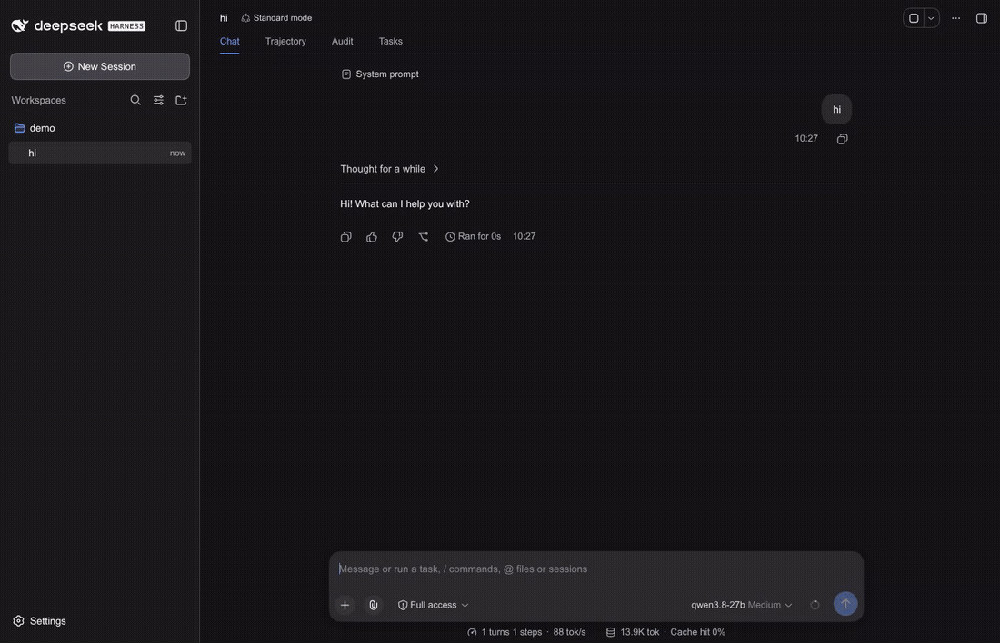

[](https://www.npmjs.com/package/filestab)
[](./LICENSE)

#  filestab

English | [中文](README.zh.md)

A replacement file viewer with vcs support for [DeepSeek Harness](https://github.com/deepseek-ai/dsh) 

## Features

Live change tracking (jj or git) with file diffs rendered side-by-side or unified depending on pane width:




Markdown with task lists, syntax highlighting, and mermaid diagrams:


Two clicks to start a prompt about a specific location in a file:



## Install

```sh
dsh plugin --profile web add filestab
```

Install it into the web profile, the one that runs the GUI.

## Development

To test a local checkout instead of the published package, install it directly: `dsh plugin --profile web add /path/to/filestab`

For a source checkout or local path install, run `pnpm install && npm run build` first so the bundle exists.

```sh
pnpm install     # a local (uncommitted) .npmrc may pin the pnpm store repo-locally
npm run build    # tsc (host + client) + tsdown bundle
npm test         # build + the full suite (pure parser tests + real jj/git I/O when the binaries are on PATH)
npm run e2e      # browser journeys against a sandboxed dsh instance
```

[CHANGELOG.md](CHANGELOG.md) · [Releases](https://github.com/americanjeff/filestab/releases).
