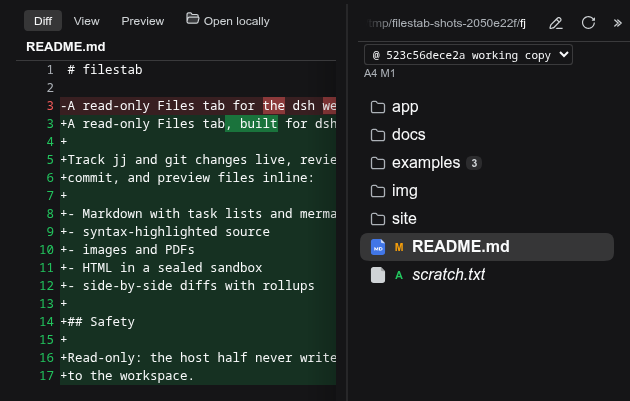
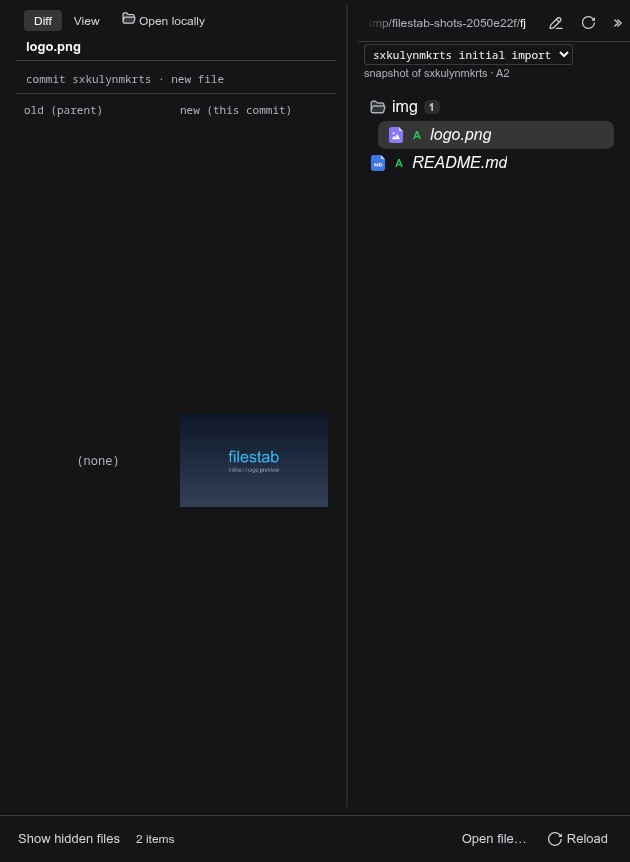
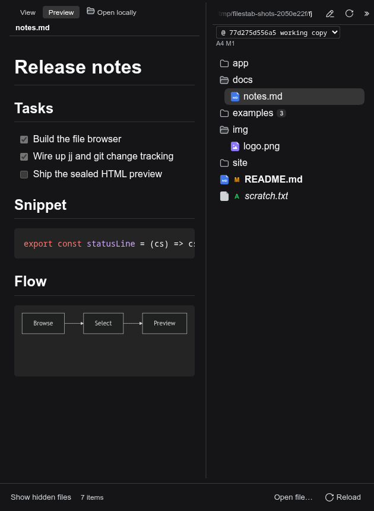
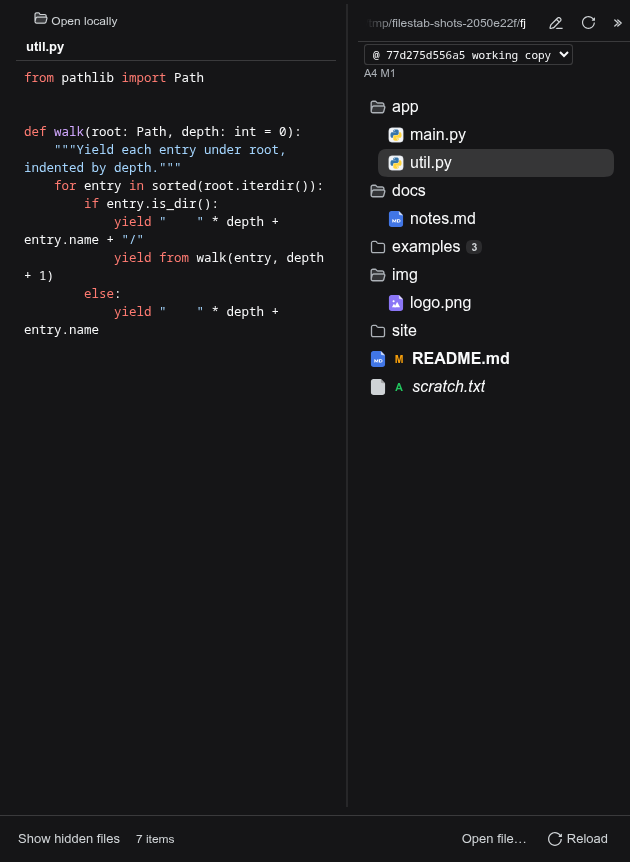
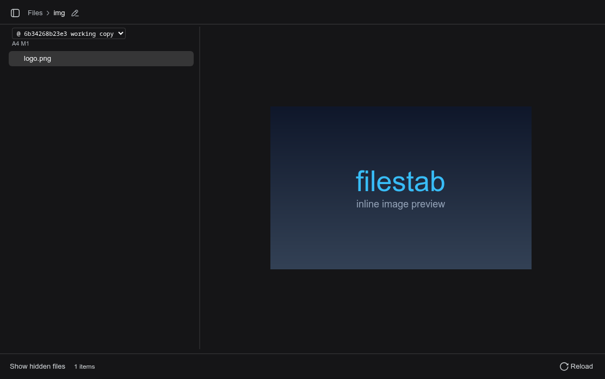
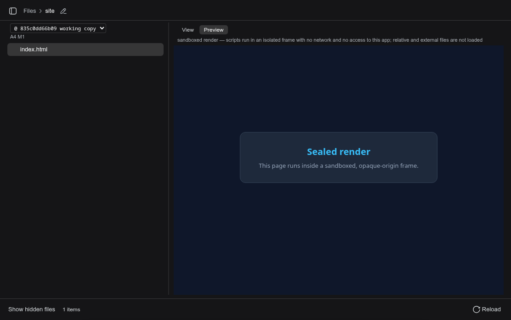

[](https://www.npmjs.com/package/filestab)
[](./LICENSE)

#  filestab

English | [中文](README.zh.md)

A read-only **Files** tab for the [dsh](https://github.com/deepseek-ai/dsh) web GUI. Use it to review changes and preview any file right in the harness.

## Features

The plugin adds a file browser to the harness featuring:

- **Live change tracking** for both [jj](https://www.jj-vcs.dev/latest/) and git-only repos.
- **Side-by-side diff** support, able to view any change in repo history.
- **Preview** files right in the harness. First-class rendering for Markdown, syntax highlighting for source code, and HTML preview in a sandboxed frame.

## What it looks like

### Reviewing changes

Per-folder change rollups, per-file status markers (M, A), and the side-by-side diff of a changed file:



### History: snapshot mode

The commit dropdown selects the current state or any recent commit. Picking a commit shows its exact tree, here with an added file (`A`) and a binary change rendered as a card:



### Preview: Markdown

Rendered Markdown with task lists, a syntax-highlighted code fence, and a mermaid diagram rendered in a sealed iframe:



### Preview: source and binaries

Syntax-highlighted source in the View pane, and image/PDF files rendered inline:





### Preview: HTML

HTML files run in a sealed iframe:



## Install

```sh
dsh plugin --profile web add filestab
```

Install it into the web profile, the one that runs the GUI.

## Safety

- **Read-only.** The host half exposes read-only methods; nothing in the workspace is ever modified.
- **Sealed renderers.** File-derived scripts never run in the GUI's origin: sandboxed HTML and mermaid diagrams run in an opaque-origin iframe (`sandbox="allow-scripts"` only, no same-origin access, CSP `default-src 'none'`), and mermaid renders at its `antiscript` security level. Some interactive functionality is blocked along with the possible malicious code.

## Development

To test a local checkout instead of the published package, install it directly: `dsh plugin --profile web add /path/to/filestab`

The published npm package ships a prebuilt `dist/` bundle (built during `prepack`), so registry installs need no build step. For a source checkout or local path install, run `pnpm install && npm run build` first so the bundle exists. `dsh.cordis.yml` is the plugin's registration manifest; its header comment documents the constraints.

```sh
pnpm install     # a local (uncommitted) .npmrc may pin the pnpm store repo-locally
npm run build    # tsc (host + client) + tsdown bundle
npm test         # build + the full suite (pure parser tests + real jj/git I/O when the binaries are on PATH)
npm run e2e      # browser journeys against a sandboxed dsh instance
```

The test files are plain `node` scripts (assert + a counter), run one by one by the `test` script. They are not `node:test` suites, so `node --test` will discover nothing in them.

The client bundle must keep its CJS interop shape (`window.__ModuleLoader__.load` wrapper, flat named exports); see `tsdown.config.ts`.

## Changelog

Coarse, per-release: [CHANGELOG.md](CHANGELOG.md) · [Releases](https://github.com/americanjeff/filestab/releases).

## License

MIT. See [LICENSE](./LICENSE).
