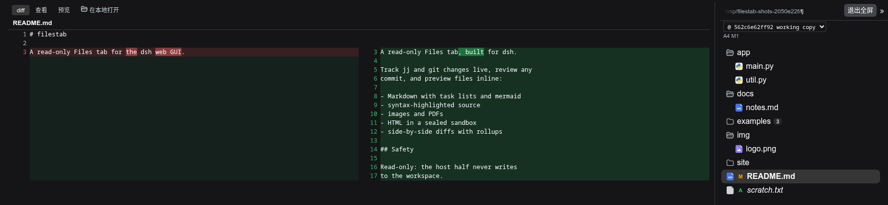

[](https://www.npmjs.com/package/filestab)
[](./LICENSE)

#  filestab

[English](README.md) | 中文

[DeepSeek Harness](https://github.com/deepseek-ai/dsh) 的替换文件查看器（支持版本控制）

## 功能

实时变更跟踪（jj 或 git），diff 以并排或统一视图渲染，取决于窗格宽度与内容宽度：




带任务列表、语法高亮和 mermaid 图表的 Markdown：


## 安装

```sh
dsh plugin --profile web add filestab
```

请安装到 web profile，即运行 GUI 的那个 profile。

## 开发

要测试本地检出（而非已发布的包），可以直接安装：`dsh plugin --profile web add /path/to/filestab`

发布到 npm 的包附带预构建的 `dist/` bundle（在 `prepack` 阶段构建），因此 registry 安装无需构建步骤。源码检出或本地路径安装请先运行 `pnpm install && npm run build` 生成 bundle。

```sh
pnpm install     # 本地（未提交的）.npmrc 可将 pnpm store 固定在仓库内
npm run build    # tsc（宿主端 + 客户端）+ tsdown 打包
npm test         # 构建 + 完整测试套件（纯解析器测试 + jj/git 在 PATH 时做真实 I/O）
npm run e2e      # 针对沙盒 dsh 实例的浏览器旅程
```

## 变更记录

按版本粗略记录：[CHANGELOG.md](CHANGELOG.md) · [Releases](https://github.com/americanjeff/filestab/releases)。

## 许可证

MIT。见 [LICENSE](./LICENSE)。
