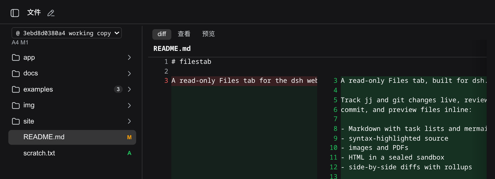
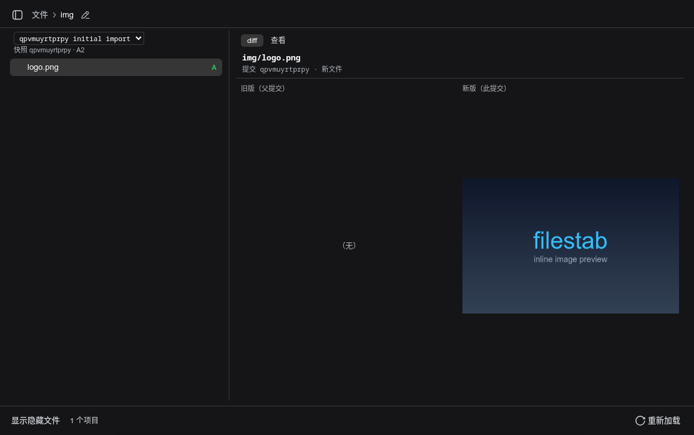
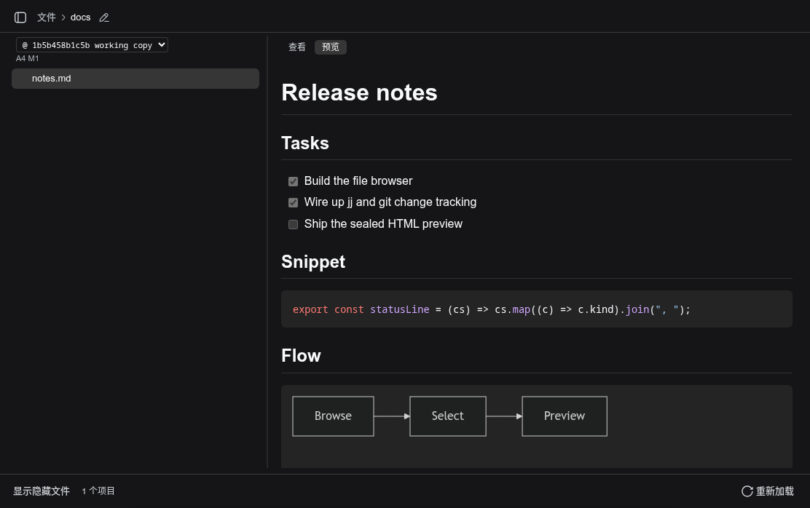
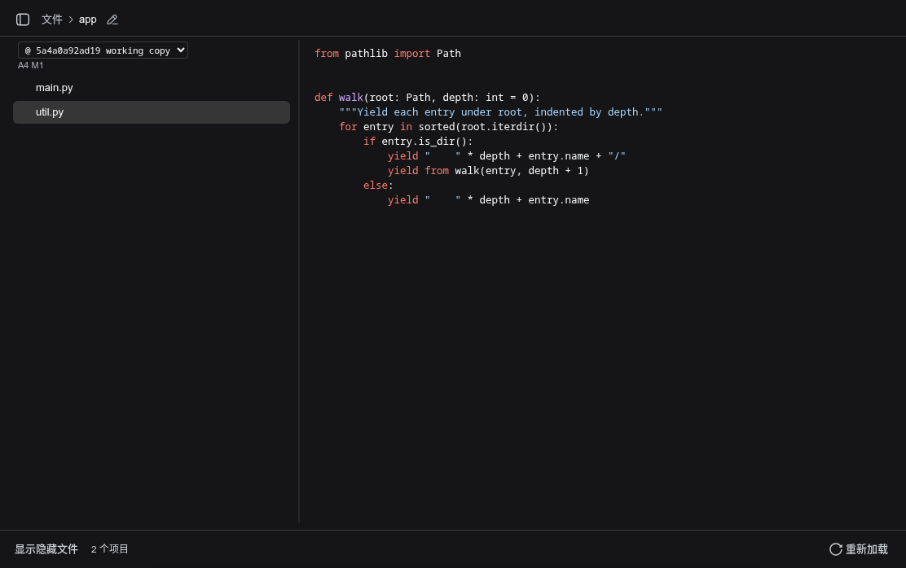
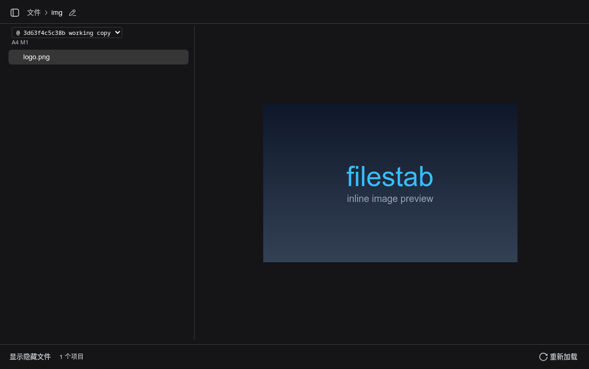
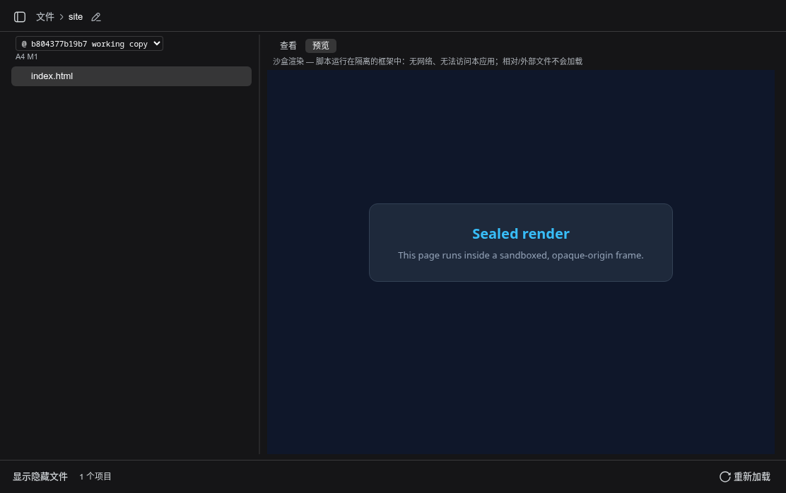

[](https://www.npmjs.com/package/filestab)
[](./LICENSE)

# filestab

[English](README.md) | 中文

为 [dsh](https://github.com/deepseek-ai/dsh) web GUI 添加的只读 **文件** 标签页：
在 harness 中查看变更，预览任意文件。

## 功能

filestab 为 harness 添加一个文件浏览器，具备以下功能：

- **VCS 支持：** 同时支持 **jj** 和 **git** 仓库的实时变更跟踪。
- **Diff：** 并排 diff，可查看仓库历史中的任意一次变更。
- **预览：** 在 harness 中直接预览文件：Markdown、语法高亮的源代码、
  内联图片，以及在沙盒框架中渲染的 HTML。

## 效果展示

### 查看变更

按文件夹汇总的变更数、每文件的状态标记（M、A），以及变更文件的并排 diff：



### 历史：快照模式

提交下拉框可选择当前状态或任意较早提交。选中某个提交后显示其精确的
目录树，图中为一个新增文件（`A`）和以卡片形式渲染的二进制变更：



### 预览：Markdown

渲染后的 Markdown：任务列表、语法高亮的代码块，以及在密封 iframe 中
渲染的 mermaid 图表：



### 预览：源代码与二进制文件

预览面板中的语法高亮源代码，以及内联渲染的图片/PDF 文件：





### 预览：HTML

HTML 文件运行在密封的 iframe 中：



## 安装

```sh
dsh plugin --profile web add filestab
```

请安装到 web profile，即运行 GUI 的那个 profile。

## 安全性

- **只读。** 宿主端只暴露只读方法；工作区中的内容永不会被修改。
- **密封的渲染器。** 由文件内容派生的脚本绝不在 GUI 的源（origin）中
  运行：沙盒 HTML 与 mermaid 图表运行在不透明源的 iframe 中（仅
  `sandbox="allow-scripts"`，无同源访问，CSP 为 `default-src 'none'`），
  mermaid 以 `antiscript` 安全级别渲染。部分交互功能会连同可能的恶意
  代码一起被屏蔽。

## 开发

要测试本地检出（而非已发布的包），可以直接安装：
`dsh plugin --profile web add /path/to/filestab`

发布到 npm 的包附带预构建的 `dist/`（在 `prepack` 阶段构建），因此 registry
安装无需构建步骤。源码检出或本地路径安装请先运行 `pnpm install && npm run build`
生成 bundle。`dsh.cordis.yml` 是插件的注册清单，其头部注释记录了相关约束。

```sh
pnpm install     # 已提交的 .npmrc 固定了仓库本地的 pnpm store
npm run build    # tsc（宿主端 + 客户端）+ tsdown 打包
npm test         # 构建 + 完整测试套件（纯解析器测试 + jj/git 在 PATH 时做真实 I/O）
npm run e2e      # 针对沙盒 dsh 实例的浏览器旅程
```

测试文件是普通的 `node` 脚本（assert + 计数器），由 `test` 脚本逐个运行。
它们不是 `node:test` 套件，因此 `node --test` 发现不了它们。

客户端 bundle 必须保持 CJS 互操作形态（`window.__ModuleLoader__.load`
包装、扁平命名导出）；见 `tsdown.config.ts`。

## 许可证

MIT。见 [LICENSE](./LICENSE)。
