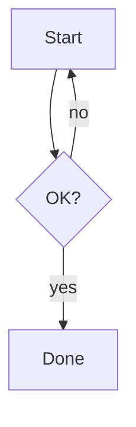
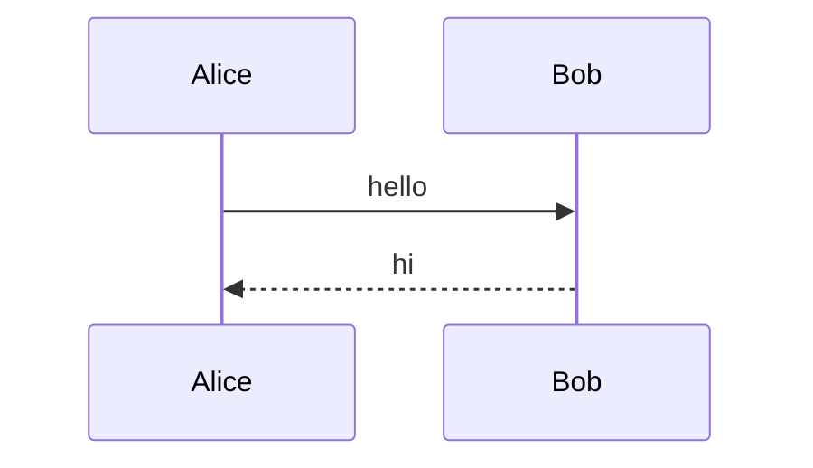

# Kitchen sink: every Markdown feature the Files tab renderer must handle

Compare **this rendering** (filestab) against `kitchen-sink.gfm.html` in the same
folder -- cmark-gfm 0.29.0 is the exact engine GitHub runs, in GitHub-like styling.
Each section notes what to look for.

---

## 1. Headings

# H1 ATX
## H2 ATX
### H3 ATX
#### H4 ATX
##### H5 ATX
###### H6 ATX

Setext level 1
===============

Setext level 2
-------------

Heading with **bold**, *italic*, and `inline code` inside.

---

## 2. Inline styles

**Bold**, *italic*, ***bold-italic***, and ~~struck through~~ (GFM).
Inline code: `const x = 1;`, and a code span containing backticks: `` `tick` ``.
Single-asterisk paragraph: the * here stays literal.
Escapes: \*not italic\*, \[not a link\], and a \\ backslash.
Entities: &amp; &lt; &gt; &#65; &copy; and an unknown entity &notanentity;
Nested emphasis: *italic containing **bold** and `code` inside*.
Code spans keep internal spacing: `if (a  ==  b) { }`, and a leading/trailing
space is stripped: `  padded  `. A lone backtick ` stays literal, and an
unclosed bold marker (**unclosed) stays literal too.

---

## 3. Links, images, autolinks

[Inline link](https://spec.commonmark.org/) and [another](https://example.com).
[Reference link][ref] -- core CommonMark, resolved by both.

[ref]: https://example.com/ref-target


Angle autolink (core): <https://autolink.core.example>.
GFM bare URL: https://www.example.com/no-angle-brackets .
GFM www form: www.example.com/plain .
Unsafe, must stay non-clickable: [js link](javascript:alert(1)) and raw .
With a title: [titled link](https://example.com/t "the title") .
Shortcut reference [shortcut] and collapsed reference [collapsed][] use the definitions below.
URL with spaces (angle-bracketed): [spaced](<https://example.com/a b>).

[shortcut]: https://example.com/shortcut
[collapsed]: https://example.com/collapsed

Autolink punctuation: see https://example.com/page. and www.example.com/path, -- the trailing punctuation stays outside the link in both.

---

## 4. Lists

- dash item one
- dash item two with **bold** and `code`
  - nested dash (both nest it)
    - even deeper

* asterisk bullet
+ plus bullet

1. first ordered
2. second ordered
   1. nested ordered (both nest it)

9. this ordered item looks like a fresh list at nine, but the blank line above
   keeps it in the same loose list, so both show it as item 3

10) paren-delimited ordered item (core)

- item containing a code block:

  ```js
  const inner = 1;
  ```

- item containing a blockquote:
  > quoted inside a list item

---

## 5. Task lists (GFM extension)

- [ ] unchecked task
- [x] checked task
- [ ] task with **inline styles** and `code`
- [ ] parent task
  - [x] nested done
  - [ ] nested open

---

## 6. Tables (GFM extension)

| Left   | Center | Right  |
|:-------|:------:|-------:|
| `code` | **bold** | [link](https://example.com) |
| plain  | plain  | plain  |

| Pipe |
|------|
| a \| b \| c |

| One wide column |
|-----------------|
| A very long unbroken token for overflow behavior: https://www.example.com/aaaaaaaaaaaaaaaaaaaa/bbbbbbbbbbbbbbbb/cccccccccccccccc/dddddddddddddd/eeeeeeeeeeeeeeee/ffffffffffffffff |

Code span containing an escaped pipe (stays in one cell; the backslash shows
inside the code), plus strikethrough in a cell:

| Code with pipe | Struck | Percent |
|:---------------|:------:|--------:|
| `a \| b` | ~~struck~~ | 100% |

---

## 7. Code blocks

filestab syntax-highlights tagged fences (highlight.js — GitHub's engine family;
untagged fences auto-detect and stay plain unless confident). This cmark
reference is structure-only, so code colors differ between the two panes.

Fenced, no language:

```
plain fenced line one
plain fenced line two
```

Fenced with language:

```js
function double(x) {
  return x * 2; // a comment
}
```

One fence per one of the twelve registered languages (all except javascript
shown here), then the odd fence shapes: tilde fences, a four-backtick fence
holding triple backticks, and an unregistered language (auto-detect stays
plain under the relevance-5 threshold).

```python
def double(x: int) -> int:
    return x * 2  # comment
```

```bash
#!/usr/bin/env bash
set -euo pipefail
echo "hello from $HOME"
```

```json
{ "key": [1, 2, 3], "flag": true }
```

```css
.card { display: grid; grid-template-columns: 1fr 2fr; }
```

```xml
<widget theme="dark">
  <label>hello</label>
</widget>
```

```go
func main() { fmt.Println("hi") }
```

```rust
fn main() { println!("hi"); }
```

```yaml
name: filestab
settings:
  theme: dark
```

```sql
SELECT id, name FROM files WHERE size > 1000 ORDER BY id LIMIT 10;
```

Tilde fence (typescript):

~~~ts
const n: number = 1;
~~~

Four-backtick fence holding a triple-backtick fence inside (markdown):

````markdown
# heading inside the fence
```js
const nested = `backtick`;
```
````

Unregistered language (no highlight; auto-detect stays plain):

```notareallang
Some ordinary prose that no language claims
with enough confidence to highlight.
```

Indented code (core, 4 spaces):

    indented line one
    indented line two

A paragraph, then a blank line, then a TAB-indented line (one tab = 4 columns,
so core CommonMark makes it indented code too):

	(tab-indented line -- one tab = 4 columns, code block in both)

---

## 8. Blockquotes

> Simple quote with **bold**.

> First level
> > Nested quote
> Back to first level

> Quote containing a list:
>
> - item one
> - item two

> Quote containing code:
>
>     quoted indented code

> ### A heading inside a quote
> text under the heading

> Table inside a quote (GFM):
>
> | a | b |
> |:-|:-:|
> | 1 | 2 |

---

## 9. Horizontal rules

The next six rules are all horizontal rules in both renderers.

---

***

___

- - -

* * *

****

---

## 10. Line breaks & paragraphs

Soft break (newline inside one paragraph): the CommonMark spec collapses it to
a space, and that is how GitHub renders file blobs (it keeps the break only in
issues/comments). filestab matches the file view so the preview does not
surprise on check-in; this reference uses the spec-pure default:

soft break line one
soft break line two

Hard break (two trailing spaces):  
hard break line two

Hard break (backslash at end of line): \
hard break line three

CRLF line endings (the next two lines end with CRLF in the source):

crlf line one.
crlf line two.


Long unbroken token: https://example.com/aaaaaaaaaaaaaaaaaaaaaaaaaaaaaaaaaaaaaaaa/bbbbbbbbbbbbbbbbbbbbbbbbbbbbbbbbbbbbbbbbbbbb/cccccccccccccccccccccccccccccccccccccccccc should wrap or scroll without breaking the pane.

---

## 11. Raw HTML (neither renders it as HTML; compare how the residue looks)

<div class="raw">This raw div: cmark-gfm in safe mode drops it entirely; filestab escapes it to literal text.</div>

<script>alert("xss-blocked")</script>

Inline raw: <b>bold via raw HTML?</b> No -- escaped in both.

---

## 12. Edge cases

[Unclosed link] and ![unclosed image] stay literal in both.
Two-backtick code span with backticks inside: `` `code with ` inside` ``.
Emoji and Unicode pass through: 🚀 naïve café 日本語 -- fine.

---

## 13. Mermaid (filestab extension)

filestab renders mermaid fences in a sealed sandbox iframe (same trust level as
the HTML preview) -- one frame per fence, all sharing a single fetched bundle;
cmark-gfm has no mermaid extension, so the reference pane shows the raw source
instead of the diagrams.



A second fence (different diagram type, second sandbox frame):



---

## 14. Unclosed fence (intentionally last -- swallows to EOF in both)

The fence below is never closed; per CommonMark everything after is code in
both renderers, which is the correct behavior:

```unclosed
this line and every line after is inside the unclosed fence
